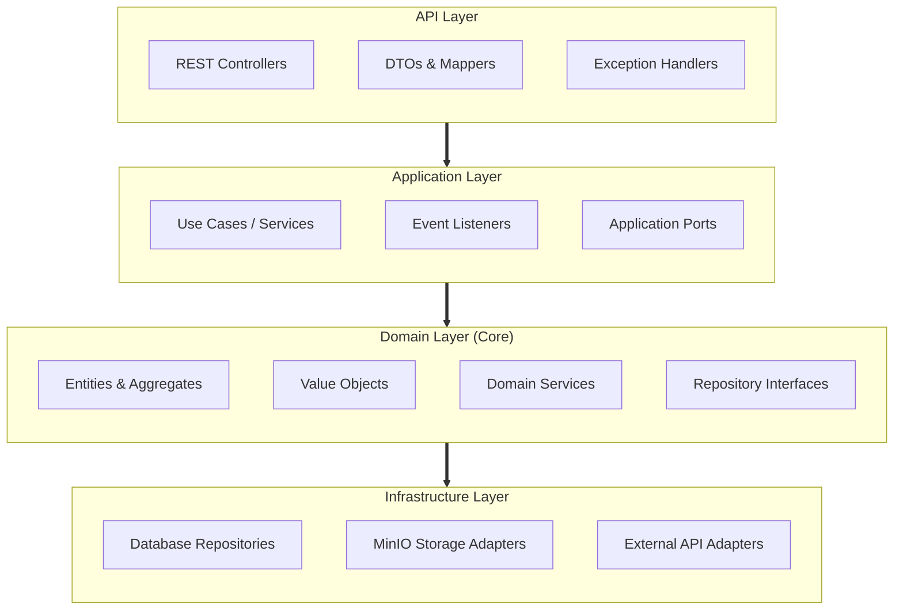
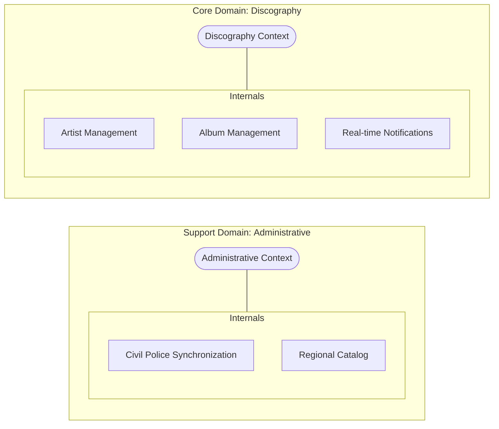
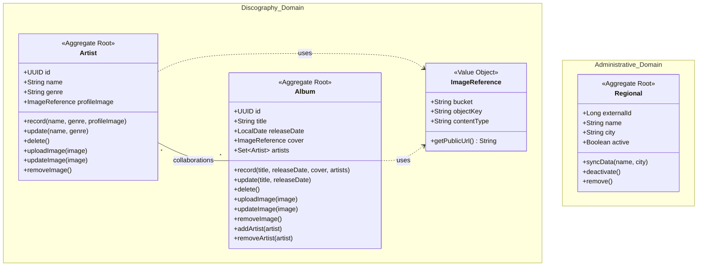

# Strategic Mapping - DDD

This document details the strategic level of the architecture, identifying the Bounded Contexts and ensuring the separation of concerns according to the
Domain Driven Development Pattern.

## Architectural Layers

This diagram represents the internal structure of each context, following the principles of Clean Architecture and DDD Tactical Design.

## Context Mapping

The diagram below illustrates the division of the project into isolated domain boundaries.

## Tatical Modeling 

Tactical modeling defines how business objects behave and relate to each other. The diagram bellow show Aggregates and Value Objects for both contexts.

## Details of Layer Relationships

* **API → Application**: Controllers receive HTTP requests, convert them to DTOs, and call the application layer methods (Use Cases). The API layer never accesses the database directly.
* **Application → Domain**: The application layer orchestrates the data flow. It uses domain entities and services to execute complex business rules. It also interacts with repository interfaces (Ports) defined in the domain.
* **Infrastructure → Domain (Dependency Inversion)**: The domain defines an interface (e.g., ArtistRepository). Infrastructure implements this interface using specific technologies (JPA, JDBC). This allows the database to be swapped without changing a single line of business logic.
* **Infrastructure → Application**: Infrastructure provides implementations for support services defined by the application, such as file storage (MinIO) or calls to external Civil Police APIs.

### Strategic Detailing

#### Bounded Contexts

* **Discography Context (Core Domain)**:
  * **Focus**: Where the business value resides for the end user. Manages the complexity of the $N:N$ relationship between artists and albums.
  * **Ubiquitous Language**: Artist, Album, Album Cover, Profile Image.

* **Administrative Context (Support Domain)**:
  * **Focus**: Provides auxiliary data required by the system (Police Regionals).
  * **Ubiquitous Language**: Regional, Synchronization, External ID, Active/Inactive Status.

#### Integration and Isolation Strategy
   * **Domain Isolation**: Contexts are independent, ensuring that changes in Civil Police synchronization rules do not directly affect the core of discography management.
   * **Anti-Corruption Layer (ACL)**: ImageReference acts as an infrastructure pattern that protects the domain from technical details of MinIO, and the PoliceApiAdapter protects the administrative domain from changes in the Civil Police API.
   * **Domain Events**: Communication between persistence in the Core Domain and the user interface is mediated by events, ensuring the domain does not directly depend on WebSocket technology.