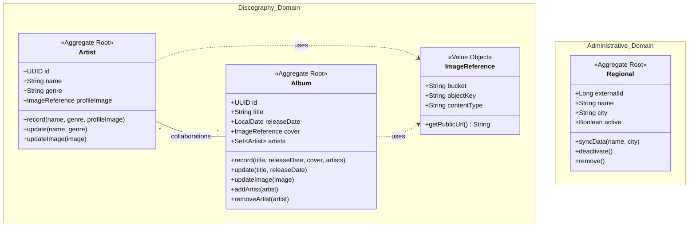

# Strategic Mapping - DDD

This document details the strategic level of the architecture, identifying the Bounded Contexts and ensuring the separation of concerns according to the
Domain Driven Development Pattern.

## Architectural Layers

This diagram represents the internal structure of each context, following the principles of Clean Architecture and DDD Tactical Design.

## Context Mapping

The diagram below illustrates the division of the project into isolated domain boundaries.

## Tatical Modeling 

Tactical modeling defines how business objects behave and relate to each other. The diagram bellow show Aggregates and Value Objects for both contexts.

## Details of Layer Relationships

* **API → Application**: Controllers receive HTTP requests, convert them to DTOs, and call the application layer methods (Use Cases). The API layer never accesses the database directly.
* **Application → Domain**: The application layer orchestrates the data flow. It uses domain entities and services to execute complex business rules. It also interacts with repository interfaces (Ports) defined in the domain.
* **Infrastructure → Domain (Dependency Inversion)**: The domain defines an interface (e.g., ArtistRepository). Infrastructure implements this interface using specific technologies (JPA, JDBC). This allows the database to be swapped without changing a single line of business logic.
* **Infrastructure → Application**: Infrastructure provides implementations for support services defined by the application, such as file storage (MinIO) or calls to external Civil Police APIs.

## Layer Intentions

### API Layer
**Intention**: To serve as the entry point for all external interactions, handling HTTP communication protocol concerns while keeping the business logic pure.

**Responsibilities**:
- Accept HTTP requests and convert them to internal application commands
- Validate request format and basic input validation
- Transform domain objects to DTOs for external consumption
- Handle HTTP-specific concerns (status codes, headers, content negotiation)
- Provide exception handling translated to appropriate HTTP responses
- Serve as the contract boundary between external clients and the application

**Key Design Principle**: The API layer should be thin, delegating all business logic to lower layers and never accessing the database directly.

### Application Layer
**Intention**: To orchestrate the execution of use cases and coordinate the flow of data between the API layer and domain layer.

**Responsibilities**:
- Implement application-specific business workflows and use cases
- Coordinate domain objects and services to achieve business goals
- Manage transaction boundaries and coordinate persistence operations
- Handle application-level events and notifications
- Provide a clear interface for the API layer to interact with business logic
- Implement application ports and interfaces for dependency inversion

**Key Design Principle**: The application layer orchestrates but doesn't contain business rules. It coordinates the work of domain objects and manages the technical aspects of application execution.

### Domain Layer (Core)
**Intention**: To encapsulate the core business logic, rules, and model of the application. This is the heart of the application where true business value resides.

**Responsibilities**:
- Define business entities, value objects, and aggregates with their invariants
- Implement core business rules and domain logic
- Provide domain services for complex business operations
- Define repository interfaces for data access abstraction
- Maintain the integrity and consistency of business objects
- Establish the ubiquitous language of the business domain

**Key Design Principle**: The domain layer should be completely independent of infrastructure concerns and external dependencies, making it highly testable and focused purely on business logic.

### Infrastructure Layer
**Intention**: To provide technical implementations and external integrations while adhering to the abstractions defined by higher layers.

**Responsibilities**:
- Implement repository interfaces defined in the domain layer
- Provide adapters for external systems (MinIO, Civil Police API, etc.)
- Handle database access, ORM mapping, and query execution
- Manage file storage operations and external service integrations
- Implement technical concerns like logging, monitoring, and caching
- Provide concrete implementations of application ports and services

**Key Design Principle**: The infrastructure layer depends on abstractions from higher layers but never the reverse. This allows technical concerns to be changed without affecting business logic.

### Strategic Detailing

#### Bounded Contexts

* **Discography Context (Core Domain)**:
  * **Focus**: Where the business value resides for the end user. Manages the complexity of the $N:N$ relationship between artists and albums.
  * **Ubiquitous Language**: Artist, Album, Album Cover, Profile Image.

* **Administrative Context (Support Domain)**:
  * **Focus**: Provides auxiliary data required by the system (Police Regionals).
  * **Ubiquitous Language**: Regional, Synchronization, External ID, Active/Inactive Status.

#### Integration and Isolation Strategy
   * **Domain Isolation**: Contexts are independent, ensuring that changes in Civil Police synchronization rules do not directly affect the core of discography management.
   * **Anti-Corruption Layer (ACL)**: ImageReference acts as an infrastructure pattern that protects the domain from technical details of MinIO, and the PoliceApiAdapter protects the administrative domain from changes in the Civil Police API.
   * **Domain Events**: Communication between persistence in the Core Domain and the user interface is mediated by events, ensuring the domain does not directly depend on WebSocket technology.